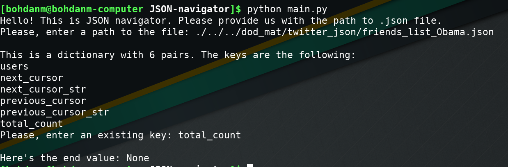

# JSON-navigator
JSON-navigator provides its user with ability to navigate through JSON object. To utilize provided funtionality, run `$ python3 main.py` in the terminal, previously having cloned the repository, or import main.py.

main.py is the main module of the program. It contains ask_json function that asks user the path to the json file and navigate_json funtion that navigates through the passed in json object.

## Example of execution of main.py

